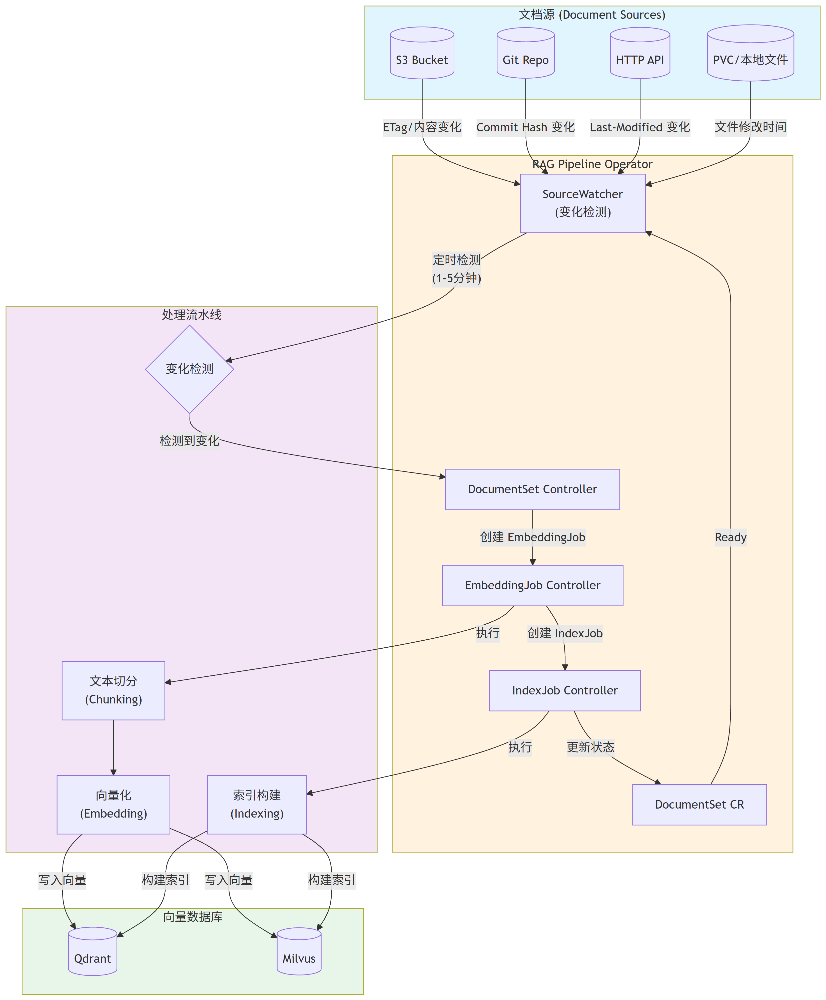

# RAG Pipeline Operator

一个 Kubernetes Operator，用于自动化管理 RAG (Retrieval-Augmented Generation) 知识库的全生命周期，包括文档采集、文本切分、向量化和索引构建。

## Description

RAG Pipeline Operator 提供了一种声明式的方式来管理知识库的构建和同步流程。通过定义 `DocumentSet` 自定义资源，您可以：

- **自动化流水线**: 自动完成 文档采集 → 文本切分(Chunking) → 向量化(Embedding) → 索引构建(Indexing) 的完整流程
- **多源支持**: 支持 S3、Git、HTTP、PVC 等多种文档源
- **多向量库**: 支持 Qdrant、Milvus、Weaviate 等主流向量数据库
- **自动同步**: 检测文档源变化，实现分钟级自动同步
- **零停机更新**: 通过 Collection Alias 实现知识库的平滑切换

### 架构图



### 核心 CRD

| CRD | 说明 |
|-----|------|
| `DocumentSet` | 定义知识库的文档源、切分策略、向量化配置和同步策略 |
| `EmbeddingJob` | 执行文档的切分和向量化任务 |
| `IndexJob` | 执行向量索引的构建和优化任务 |

---

## Auto-Sync: 知识库分钟级自动同步

### 功能概述

当文档源发生变动时，Operator 自动触发同步流程：

```
变化检测 → 文本切分 (Chunking) → 向量化 (Embedding) → 写入向量库
```

### SyncPolicy 配置

```yaml
syncPolicy:
  mode: auto              # auto=自动同步, manual=手动触发
  interval: "1m"          # 检测间隔 (最小1分钟，默认5分钟)
  triggerOn: contentHash  # 触发方式: contentHash/modifiedTime/gitCommit/s3ETag
  incrementalSync: true   # 增量同步 (仅处理变化的文件)
  maxConcurrentSyncs: 1   # 最大并发同步数
  pauseSync: false        # 临时暂停同步
```

### 支持的变化检测方式

| 源类型 | 检测方式 | 说明 |
|--------|----------|------|
| **S3** | ETag + ContentHash | 对比文件列表和 ETag 哈希值 |
| **Git** | Commit Hash | 检测新的 Git 提交 |
| **HTTP** | ETag/Last-Modified | 通过 HTTP HEAD 请求检查 |
| **PVC** | 文件修改时间 + 内容哈希 | 遍历文件系统计算变化 |

### 状态追踪

同步状态通过 `status.syncStatus` 字段追踪：

```yaml
status:
  phase: Ready
  syncStatus:
    state: Completed        # Idle/Checking/Syncing/Completed/Failed
    changesDetected: true
    filesAdded: 5
    filesDeleted: 1
    filesChanged: 3
    startedAt: "2025-01-15T10:00:00Z"
    completedAt: "2025-01-15T10:02:30Z"
  lastSourceCheckTime: "2025-01-15T10:00:00Z"
  lastSuccessfulSyncTime: "2025-01-15T10:02:30Z"
  syncCount: 15
  lastSourceHash: "sha256:abc123..."
```

### 使用示例

#### S3 源自动同步 (1分钟检测间隔)

```yaml
apiVersion: rag.ai/v1alpha1
kind: DocumentSet
metadata:
  name: product-docs-autosync
spec:
  source:
    type: s3
    uri: s3://company-docs/product-manuals/
    secretRef:
      name: s3-credentials
  chunking:
    size: 512
    overlap: 100
    format: markdown
  embedding:
    model: text-embedding-3-small
    device: cpu
    batchSize: 16
  index:
    vectorDB: qdrant
    collection: product_docs
    alias: product_docs_prod
  # 开启自动同步
  syncPolicy:
    mode: auto
    interval: "1m"
    triggerOn: contentHash
    incrementalSync: true
```

#### Git 仓库自动同步

```yaml
apiVersion: rag.ai/v1alpha1
kind: DocumentSet
metadata:
  name: wiki-docs-autosync
spec:
  source:
    type: git
    uri: "https://github.com/company/wiki.git#main"
    secretRef:
      name: github-token
  chunking:
    size: 1000
    overlap: 200
    format: markdown
  embedding:
    model: bge-large-en
    device: gpu
    batchSize: 32
  index:
    vectorDB: qdrant
    collection: wiki_docs
  syncPolicy:
    mode: auto
    interval: "5m"
    triggerOn: gitCommit
```

### 同步延迟

- **检测延迟**: 可配置 1-60 分钟
- **处理延迟**: 取决于文档数量和 Embedding 模型性能
- **整体延迟**: 最快可达 **分钟级** 自动同步

---

## Getting Started

### Prerequisites
- go version v1.24.6+
- docker version 17.03+.
- kubectl version v1.11.3+.
- Access to a Kubernetes v1.11.3+ cluster.

### To Deploy on the cluster
**Build and push your image to the location specified by `IMG`:**

```sh
make docker-build docker-push IMG=<some-registry>/rag-operator:tag
```

**NOTE:** This image ought to be published in the personal registry you specified.
And it is required to have access to pull the image from the working environment.
Make sure you have the proper permission to the registry if the above commands don’t work.

**Install the CRDs into the cluster:**

```sh
make install
```

**Deploy the Manager to the cluster with the image specified by `IMG`:**

```sh
make deploy IMG=<some-registry>/rag-operator:tag
```

> **NOTE**: If you encounter RBAC errors, you may need to grant yourself cluster-admin
privileges or be logged in as admin.

**Create instances of your solution**
You can apply the samples (examples) from the config/sample:

```sh
kubectl apply -k config/samples/
```

>**NOTE**: Ensure that the samples has default values to test it out.

### To Uninstall
**Delete the instances (CRs) from the cluster:**

```sh
kubectl delete -k config/samples/
```

**Delete the APIs(CRDs) from the cluster:**

```sh
make uninstall
```

**UnDeploy the controller from the cluster:**

```sh
make undeploy
```

## Verification (WSL Environment)

If you are developing in a WSL environment, ensure you have Go 1.16+ (ideally 1.23+) installed.

Run the following commands to verify the project:

1.  **Update Dependencies**:
    ```sh
    go mod tidy
    ```

2.  **Generate Code (DeepCopy methods)**:
    ```sh
    make generate
    ```

3.  **Generate Manifests (CRD YAMLs)**:
    ```sh
    make manifests
    ```

4.  **Build the Binary**:
    ```sh
    make build
    ```

## Project Distribution

Following the options to release and provide this solution to the users.

### By providing a bundle with all YAML files

1. Build the installer for the image built and published in the registry:

```sh
make build-installer IMG=<some-registry>/rag-operator:tag
```

**NOTE:** The makefile target mentioned above generates an 'install.yaml'
file in the dist directory. This file contains all the resources built
with Kustomize, which are necessary to install this project without its
dependencies.

2. Using the installer

Users can just run 'kubectl apply -f <URL for YAML BUNDLE>' to install
the project, i.e.:

```sh
kubectl apply -f https://raw.githubusercontent.com/<org>/rag-operator/<tag or branch>/dist/install.yaml
```

### By providing a Helm Chart

1. Build the chart using the optional helm plugin

```sh
kubebuilder edit --plugins=helm/v2-alpha
```

2. See that a chart was generated under 'dist/chart', and users
can obtain this solution from there.

**NOTE:** If you change the project, you need to update the Helm Chart
using the same command above to sync the latest changes. Furthermore,
if you create webhooks, you need to use the above command with
the '--force' flag and manually ensure that any custom configuration
previously added to 'dist/chart/values.yaml' or 'dist/chart/manager/manager.yaml'
is manually re-applied afterwards.

## API Reference

### DocumentSet Spec

| 字段 | 类型 | 必填 | 说明 |
|------|------|------|------|
| `source.type` | string | 是 | 源类型: s3/http/git/pvc |
| `source.uri` | string | 是 | 源地址 |
| `source.secretRef` | object | 否 | 认证 Secret 引用 |
| `chunking.size` | int | 是 | 切分大小 (字符数) |
| `chunking.overlap` | int | 是 | 切分重叠 (字符数) |
| `chunking.format` | string | 否 | 文档格式: text/markdown/html |
| `embedding.model` | string | 是 | Embedding 模型名称 |
| `embedding.device` | string | 否 | 运行设备: cpu/gpu |
| `embedding.batchSize` | int | 否 | 批处理大小 |
| `index.vectorDB` | string | 是 | 向量库类型: qdrant/milvus/weaviate |
| `index.collection` | string | 是 | Collection 名称 |
| `index.alias` | string | 否 | Collection 别名 (用于零停机切换) |
| `syncPolicy` | object | 否 | 自动同步策略 |

### DocumentSet Status

| 字段 | 说明 |
|------|------|
| `phase` | 当前阶段: Pending/Embedding/Indexing/Ready/Failed |
| `syncStatus` | 同步状态详情 |
| `lastSourceHash` | 源内容哈希 |
| `lastSourceCheckTime` | 最后检测时间 |
| `lastSuccessfulSyncTime` | 最后成功同步时间 |
| `syncCount` | 累计同步次数 |
| `totalChunks` | 总切分数 |
| `totalVectors` | 总向量数 |

## Contributing

欢迎贡献代码！请遵循以下步骤：

1. Fork 本仓库
2. 创建特性分支 (`git checkout -b feature/amazing-feature`)
3. 提交更改 (`git commit -m 'Add amazing feature'`)
4. 推送分支 (`git push origin feature/amazing-feature`)
5. 创建 Pull Request

**NOTE:** Run `make help` for more information on all potential `make` targets

More information can be found via the [Kubebuilder Documentation](https://book.kubebuilder.io/introduction.html)

## License

Copyright 2025 rag-team.

Licensed under the Apache License, Version 2.0 (the "License");
you may not use this file except in compliance with the License.
You may obtain a copy of the License at

    http://www.apache.org/licenses/LICENSE-2.0

Unless required by applicable law or agreed to in writing, software
distributed under the License is distributed on an "AS IS" BASIS,
WITHOUT WARRANTIES OR CONDITIONS OF ANY KIND, either express or implied.
See the License for the specific language governing permissions and
limitations under the License.

